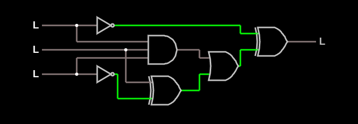

# Hardware Modelling

> **Original version:** this README and some fixes were added in 2026. To see the project exactly as it was first built, browse commit [`be64a32`](https://github.com/dianapaula19/hardware-modelling-course/tree/be64a32b5fc7a401d3f834718e3cd9577b552e6d) (2020-08-06).

Homework for the *Hardware Modelling* course at the University of
Bucharest: digital logic in Verilog, MIPS assembly, and information theory in C++.

## Verilog ([`Verilog/`](Verilog/))

1. **Logic circuit**, `((A·B·C) + (B + ¬C)) ⊕ ¬A`, modelled twice: structurally from gates
   (`verilog_1_structural.v`) and behaviourally (`verilog_1_behavioural.v`), with a test bench
   that walks through all eight inputs (simulated with Icarus Verilog:
   `iverilog verilog_1_structural.v && vvp a.out`).

   

   ```
   At time  0, a = 0, b = 0, c = 0 -> out = 0
   At time 10, a = 0, b = 0, c = 1 -> out = 1
   ...
   At time 70, a = 1, b = 1, c = 1 -> out = 1
   ```

2. **BCD to 7-segment display decoder**: one sum-of-products expression per
   segment; two versions (`verilog_2_ver_1.v`, `verilog_2_ver_2.v`) with their
   test-bench output.

## MIPS assembly ([`MIPS/mips_homework.asm`](MIPS/mips_homework.asm))

Reads *n* and an *n × n* matrix into memory allocated with `sbrk`, then prints the sum of
the upper triangle (diagonal included), using macros for printing and pointer stepping. Runs in the MARS or SPIM simulator.

## Information theory ([`ShannonInformationAndHuffmanCode/`](ShannonInformationAndHuffmanCode/))

- `shannon_information.cpp`: word frequencies of `text.txt` and its **Shannon entropy**,
  H = −Σ p·log₂ p.
- `huffman_code.cpp`: builds a **Huffman tree** with a min-heap (`priority_queue`) and prints
  the prefix code of every character.

For the string `bbabbacdaeeadffabceeef` the Huffman program prints (frequent letters get
shorter codes):

```
b 00
a 01
e 10
f 110
d 1110
c 1111
```

```bash
cd ShannonInformationAndHuffmanCode
g++ shannon_information.cpp -o shannon && ./shannon
g++ huffman_code.cpp -o huffman && ./huffman
```
