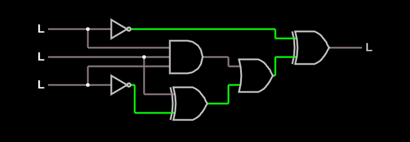

# Verilog Homework
### :page_facing_up: For each of the assignments, I created a text file of the result printed in the Test_Bench module.

#### 1. Design a circuit and implement it in Verilog, using both structural and behavioural modeling.

( ( A and B and C ) or ( B or (not C) ) ) xor (not A) = out

#### 2. Design a 7-segment display decoder.
